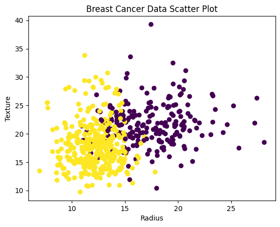
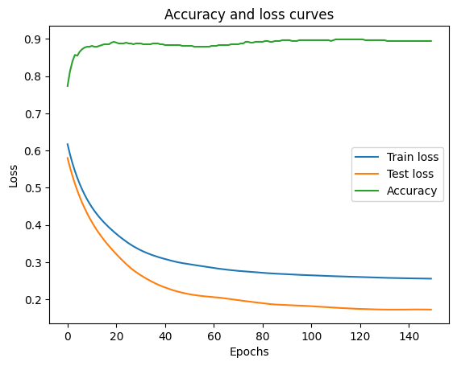

# Deep learning 

The breast cancer data set was loaded from sklearn and only the first two featurs (radius and texture) where taken as the data.

A scatterplot shows the data points using these two features and the realted classes.

The data was split into training and test dataset (80% training, 20% testing) and then preprocessed using StandardScalar() then converted from numpy arrays into tensors.

The model architecture was then made. the neural network consists of 2 linear layers, the first layer uses a relu activation function and the second layer uses sigmoid.

BCD loss function was used and Adam optimizer

the model was trained over 150 epochs

accruacy and loss was calculated and displayed over a plot showing the increase in accuracy and decrease in loss over the epochs

